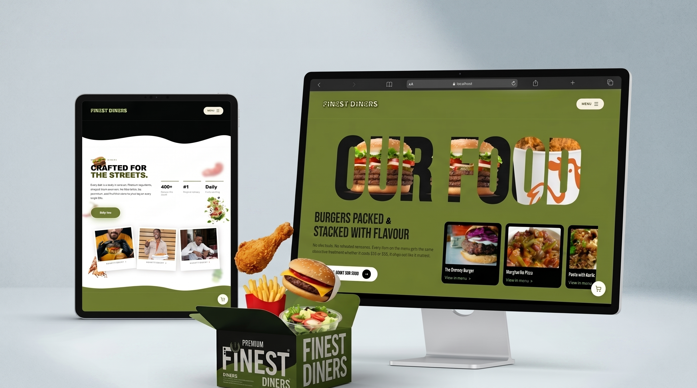
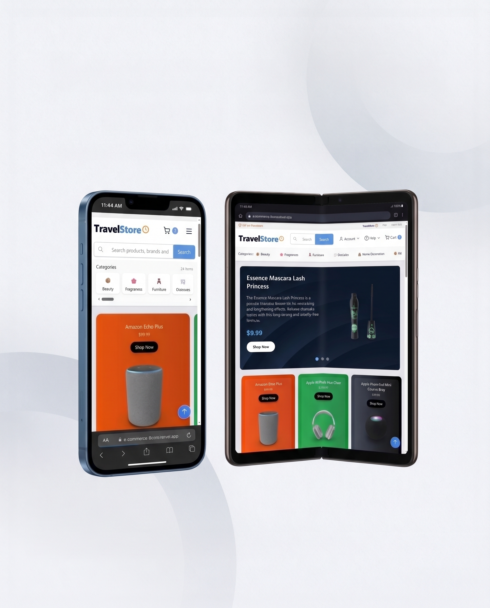
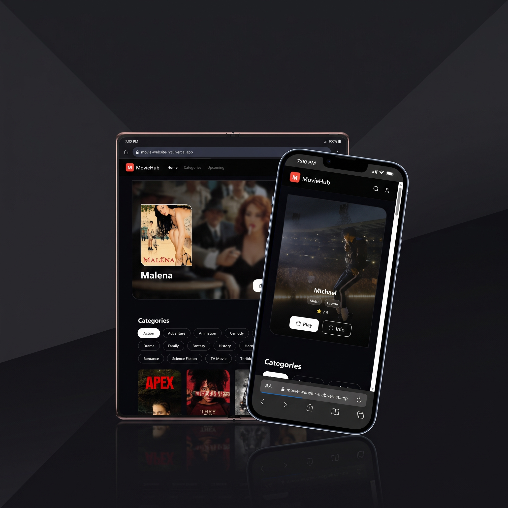
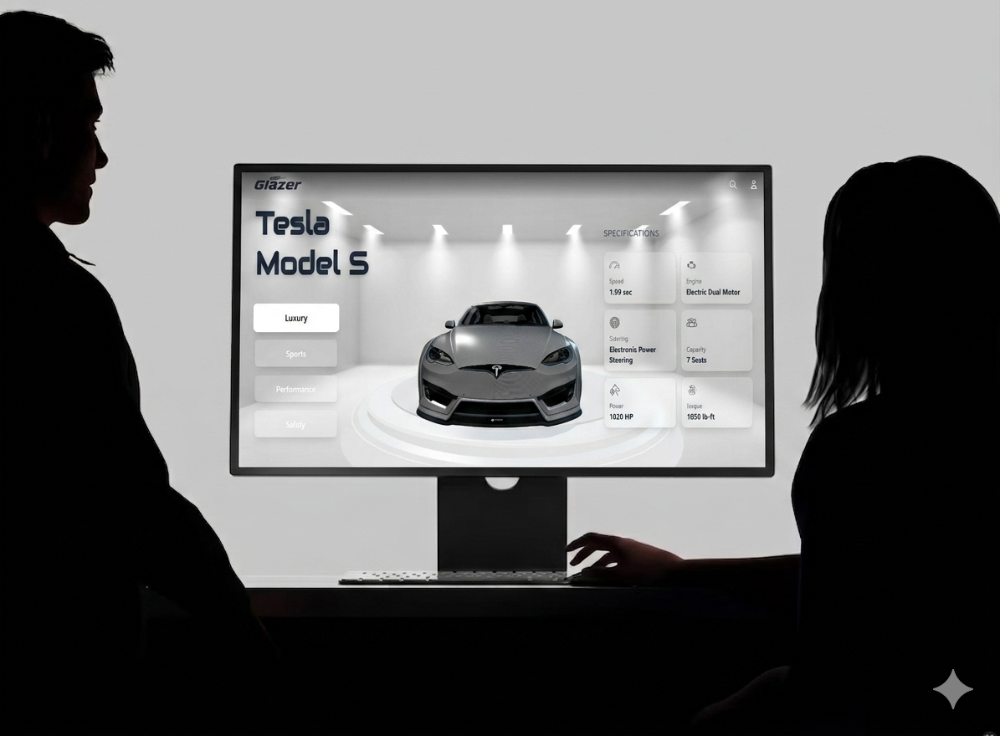
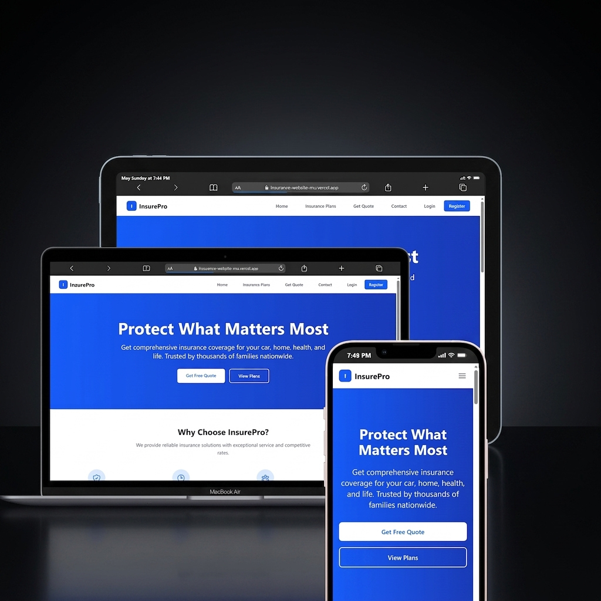

# Olokoode Elijah Portfolio

Welcome to my personal portfolio website! I'm Olokoode Elijah, a passionate front-end developer and UI/UX enthusiast dedicated to creating modern, responsive, and interactive web experiences.

## About Me

This portfolio showcases my work, skills, and experience in web development. The site features custom components, smooth animations, and a clean design to provide visitors with an engaging user experience. I specialize in building React-based applications with a focus on performance, accessibility, and user experience.

## My Projects

Here are some of the key projects I've worked on:

### 1. Finest Diners - Food Delivery Platform


A fully responsive food delivery platform enabling users to browse restaurant menus, add items to cart, and complete orders. Features secure Firebase Authentication, protected private routes, and a modular component architecture — built mobile-first for a seamless experience across all devices.

**Tech Stack:** React.js, Tailwind CSS  
**Live Demo:** [https://finest-diners-2-rihd.vercel.app/](https://finest-diners-2-rihd.vercel.app/)

### 2. TravelStore - E-Commerce Platform


A fully functional e-commerce web application for product discovery and purchasing. Integrates the DummyJSON API for real-time product data, Firebase Authentication for secure sessions, and a scalable Tailwind + React component architecture built with a mobile-first approach.

**Tech Stack:** React.js, Tailwind CSS  
**Live Demo:** [https://e-commerce-8cmx.vercel.app/](https://e-commerce-8cmx.vercel.app/)

### 3. MovieHub - Media Discovery App


A dynamic movie discovery app powered by the TMDb API, surfacing real-time film data including ratings, descriptions, and trending content. Features a client-side search for instant title lookup and a clean, fully responsive UI optimised across desktop, tablet, and mobile.

**Tech Stack:** React.js, JavaScript ES6+  
**Live Demo:** [https://movie-website-rro8.vercel.app/](https://movie-website-rro8.vercel.app/)

### 4. Glazer - 3D Automotive Showcase


An immersive front-end application showcasing automobiles with real-time 3D visualisation via the Sketchfab API. Renders high-quality, interactive 3D car models directly in the browser, wrapped in smooth UI transitions and polished responsive layouts.

**Tech Stack:** React.js, CSS3  
**Live Demo:** [https://glazer-lake.vercel.app/](https://glazer-lake.vercel.app/)

### 5. Insurepro - Insurance Platform


An insurance platform designed to provide users with comprehensive insurance solutions and services.

**Tech Stack:** React.js, Tailwind CSS  
**Status:** In Development

## Technologies Used

- **React**: For building the user interface and managing component state.
- **Vite**: For fast development, hot module replacement (HMR), and optimized builds.
- **JavaScript (JSX)**: For writing component logic and structure.
- **CSS**: For styling and layout, including custom animations.
- **ESLint**: For maintaining code quality and consistency.
- **Firebase**: For authentication and backend services.
- **Tailwind CSS**: For utility-first styling approach.
- **Sketchfab API**: For 3D model integration.
- **TMDb API**: For movie data integration.
- **DummyJSON API**: For e-commerce product data.

## Getting Started

To run this portfolio locally:

```bash
# Install dependencies
npm install

# Start development server
npm run dev

# Build for production
npm run build
```

## Contact

Feel free to reach out to me through the contact form on the portfolio or connect with me on professional platforms.

---

Built with ❤️ using React and Vite
